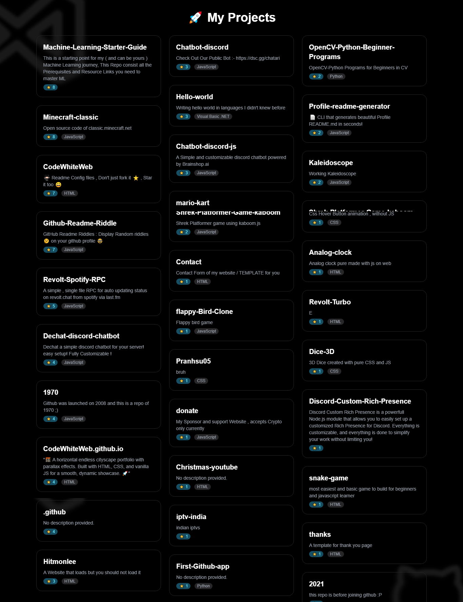

# 🌟 ShowCase

**ShowCase** is a sleek, dark-themed personal project portfolio that dynamically displays your **project GitHub repositories** using the GitHub API. It automatically loads more projects as the user scrolls and includes emoji parsing for descriptions just like GitHub.

## 🚀 Features

- 🎯 Displays all project repositories for a given GitHub user by filtering by topics
- 🔄 Infinite scroll for seamless lazy loading
- 😀 GitHub-style emoji rendering in repository descriptions
- 🌙 Dark theme with modern styling using Tailwind CSS
- 🎨 Floating SVG background elements via CDN
- ⚡ Fast, lightweight, and responsive layout

## 📸 Preview



## 🛠️ Built With

- [GitHub REST API](https://docs.github.com/en/rest)
- [Tailwind CSS (CDN)](https://tailwindcss.com/docs/installation/play-cdn)
- [Twemoji (for emoji parsing)](https://github.com/twitter/twemoji)
- [SVGRepo](https://www.svgrepo.com/) (for background visuals)

## 📦 How to Use

1. Clone the repository:
   ```bash
   git clone https://github.com/SajagIN/ShowCase.git
   ```

2. Open `index.html` in a browser.

3. Make sure your GitHub username is set correctly in the JavaScript:

   ```js
   const username = "your-github-username"; // e.g., "SajagIN"
   ```
4. Change the 'topic' variable in the JavaScript to filter repositories by topic:

   ```js
   const topic = "your-topic"; // e.g., "my-projects"
   ```

## 🧠 Customization
You can easily customize the project to fit your needs:
* Modify styles via Tailwind utility classes.
* Add or remove design elements (SVGs, hover effects, etc.) as needed.


## 🔐 GitHub API Rate Limits

The project uses the **public GitHub API**, which allows:

* 60 unauthenticated requests per hour per IP.
* You can optionally add a token for higher limits.

---

> Designed with ❤️ to showcase what you build.

---
